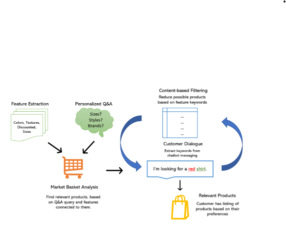

# Text-based Machine Learning for E-Commerce Chatbot System

This project implements a machine learning-based recommendation system for e-commerce chatbots. The system enhances product recommendations using personalized customer inputs and product features, improving user experience by offering more relevant suggestions.

## Table of Contents
- [Overview](#overview)
- [System Architecture](#system-architecture)
- [Methodology](#methodology)
  - [Feature Extraction](#feature-extraction)
  - [Market Basket Analysis](#market-basket-analysis)
  - [KeyBert and Content-Based Filtering](#keybert-and-content-based-filtering)
- [Experiments](#experiments)
- [Results](#results)
- [Evaluation Metrics](#evaluation-metrics)
- [Hyperparameters](#hyperparameters)
- [Conclusion](#conclusion)
- [Installation](#installation)
- [Usage](#usage)
- [Contributors](#contributors)
- [License](#license)

## Overview
The project aims to provide a more personalized e-commerce chatbot by combining natural language processing (NLP) techniques and machine learning models. It helps users find relevant products based on their inputs and personal preferences using methods like Market Basket Analysis (MBA) and KeyBert for feature extraction.

## System Architecture
The system is designed to process user inputs, extract key features, and provide relevant product recommendations. It integrates three primary steps:
1. **Feature Engineering:** Extracts important product attributes (e.g., brand, color, texture).
2. **Association and Filtering:** Uses Market Basket Analysis (MBA) to find associations between product features.
3. **Relevance:** Filters and ranks recommendations using cosine similarity and KeyBert to ensure recommendations are both diverse and relevant.

## Methodology
### Feature Extraction
Key product attributes, such as brand names, colors, and styles, are extracted from a dataset. For example:
{ "BrandName": "Life", "Colors": "Red", "Textures": "Polyester", "Styles": "Blend", "Types": "Dress" }

### Market Basket Analysis
Market Basket Analysis is applied to identify frequently co-purchased products based on extracted features. The **lift** metric is used to evaluate the association strength of the products.

### KeyBert and Content-Based Filtering
KeyBert, a variant of BERT, is used to extract the most relevant key phrases from user queries and chat messages. It ranks features based on relevance to refine product recommendations.

## Experiments
The model was tested on an [e-commerce fashion dataset](https://www.kaggle.com/datasets/mukuldeshantri/ecommerce-fashion-dataset) containing nearly 30,000 women’s fashion products (clothing, jewelry, perfumes, etc.). Feature extraction was applied to brand names and product details.

## Results
Through a series of evaluations, the system demonstrated an improved capacity to deliver relevant recommendations while maintaining a good variety of product suggestions.

## Evaluation Metrics
1. **Cosine Similarity (s):** Measures similarity between the user query and recommended products.
2. **Score Capacity (σ):** Ratio of products found by the model compared to direct querying.
3. **Query Distance (ω):** Measures variability in results between the model and standard querying.

## Hyperparameters
1. **Lift (λ):** Defines the minimum acceptable lift in MBA.
2. **Similarity Threshold (α):** Controls the filtering of irrelevant products.
3. **KeyBert Filter Rate (β):** Adjusts the filtering sensitivity in the KeyBert model.

## Conclusion
This system provides a robust solution for personalized product recommendations in e-commerce chatbots, offering improvements in both relevance and variety. The architecture allows for feature-rich, yet computationally feasible, product recommendations.
